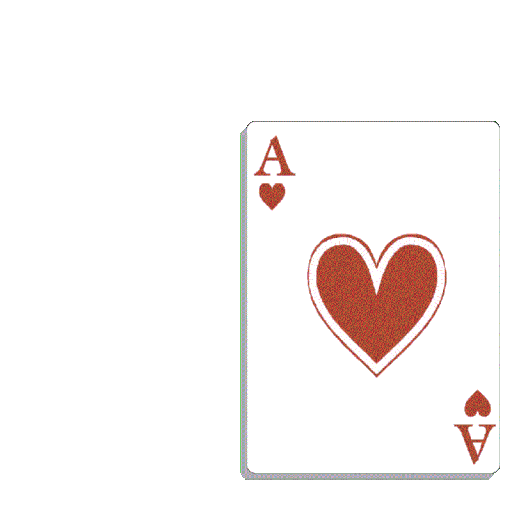

# World War 3: A preprogrammed War Game!

**Rules:**
1. Large deck split into halves for Player 1 and Player 2 
2. Player 1 draws three cards from their deck at random 
3. Player 2 draws three cards from their deck at random
4. Cards are organized in descending order with sorting algorithm 
5. Card at the third index of the sorted card list is chosen as the victory card
6. The player who added te vvictory card is awarded 1 point and a new round begins
7. The player with the most points after 3 rounds wins and the game restarts

